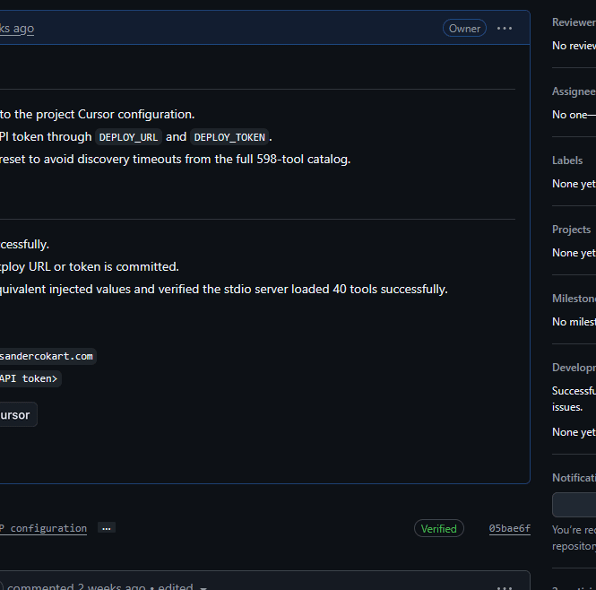
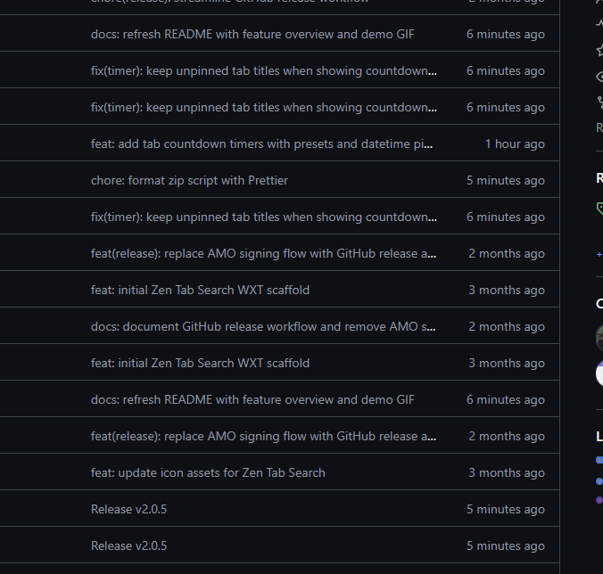
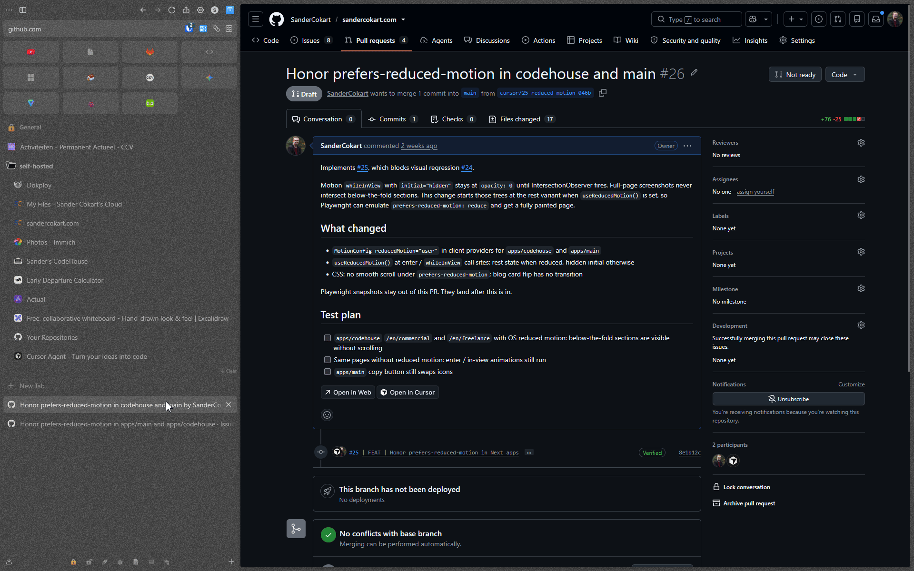

# Zen Tab Search Anytime and Anywhere

Find any tab, switch spaces, add context, and stay focused in Zen Browser.

Zen Tab Search is a fast fuzzy search overlay and popup for tabs, spaces, and custom labels. It is exclusive to [Zen Browser](https://zen-browser.app/).

## Features

### Search any tab and custom labels across spaces

Search tab titles, URLs, and custom labels from one place—even when the tab is in another Zen space. Results update as you type, and keyboard navigation lets you activate a tab without leaving the current page.



### Set timers for tabs

Set a timer on the current tab from the popup or keyboard shortcut. The remaining time appears in the tab label, active timers can be reviewed together, and Zen Tab Search restores timers after a restart and notifies you when they finish.



### Automatic GitLab and GitHub issue and MR/PR labels

On GitLab and GitHub issue, merge request, and pull request pages, the label shortcut reads the page URL and title and creates a useful custom label automatically. For example:

- `ISSUE: #123 - Fix the search results`
- `MR: #123 - !45 - Improve tab search`
- `PR: #123 - !45 - Improve tab search`

On other pages, the same shortcut opens Zen's native Change Label editor.



## Keyboard shortcuts

Shortcuts use `Ctrl` on Windows/Linux and `⌘` on macOS. Change or assign extension shortcuts in `about:addons` → **Zen Tab Search** → **Manage Extension Shortcuts**.

- `Ctrl+Shift+F` — Open the in-page search overlay when a content tab is active
- `Ctrl+Alt+F` — Open the popup search UI; also works when no web page tab is active
- `Ctrl+Alt+T` — Open the timer for the current tab
- User-assigned **Change Zen label** shortcut — Auto-label GitLab/GitHub issues and MR/PRs, or open Zen's Change Label editor
- `Arrow keys` / `Page Up` / `Page Down` — Navigate results; use `Left` / `Right` with Page Up/Down for larger jumps
- `Enter` — Activate the selected result
- `Escape` — Close the search UI

## Installation

### From a GitHub release (recommended)

1. Download the latest `.zip` from the [Releases page](https://github.com/SanderCokart/Zen-Tab-Search-Anytime-and-Anywhere/releases).
2. Open `about:config` in Zen Browser.
3. Set these preferences to `true` and restart Zen:
   - `extensions.experiments.enabled`
   - `xpinstall.signatures.required`
4. Open `about:addons`, click the gear icon, and choose **Install Add-on From File…**.
5. Select the downloaded `.zip` (you can also drag it onto the page).

### Build from source

```bash
npm install
npm run zip
```

The zip will be produced by WXT. Install it using the same `about:addons` → gear → **Install Add-on From File…** flow above.

## At a glance

- Fuzzy search across tab titles, URLs, spaces, and Zen custom labels
- Search and switch between all Zen spaces
- Fast in-page overlay plus a popup that works without an active web page
- Custom tab timers with countdown labels and completion notifications
- Automatic custom labels for GitLab/GitHub issues, merge requests, and pull requests
- Real-time results with keyboard navigation

## Important notices

- This extension is exclusive to Zen Browser and relies on Zen's internal workspace and tab APIs.
- It uses privileged `experiment_apis`, so it cannot be published on addons.mozilla.org (AMO) and must be installed from a zip file.
- The two `about:config` preferences above are required for Zen's extension APIs to be available.

## Credits and license

This project is based on https://github.com/AntonDobrovinskiy/Zen-Tab-Search, which is released under the MIT license. Anton Dobrovinskiy retains the copyright as per the MIT license.

This repository is a fork of that project with rewritten git history.

See [LICENSE](LICENSE) for the full MIT license text.

## Why this cannot be published on AMO

Mozilla intentionally blocks extensions that declare `experiment_apis` (privileged Experiment APIs) from being submitted to addons.mozilla.org, so this repository does not maintain an AMO signing flow. End users still need the two `about:config` changes for the Zen-specific APIs (`browser.zenTabs`) to be available.

The only supported distribution method for this extension is sideloading a zip (or XPI) as described above.

## Creating a release

Releases are published as GitHub release zips. The release script bumps the package version, commits the version files, tags the commit, builds the extension zip, creates a GitHub release, and attaches the zip.

```bash
npm run release -- patch --message "Maintenance release"
npm run release -- minor --notes-file ./RELEASE.md
npm run release -- patch --generate-notes
npm run release -- patch --dry-run --generate-notes
```

Use `patch`/`bump`, `minor`, `major`, or an exact `x.y.z` version. Release notes can be supplied with `--message`, loaded with `--notes-file`, or generated from commits since the latest tag with `--generate-notes`. The script requires a clean working tree and an authenticated GitHub CLI session (`gh auth login`) before it starts.

Release checklist:

1. Start from `main` with `git status` clean.
2. Confirm GitHub CLI auth with `gh auth status`.
3. Preview the release with `npm run release -- patch --dry-run --generate-notes`.
4. Run the release command, for example `npm run release -- patch --generate-notes`.
5. Confirm the GitHub release contains the `zen-tab-search-<version>-firefox.zip` asset.

If a release fails, follow the recovery instructions printed by the script before retrying.

## Development

**Using Cursor?** Run the [`/quick-start`](.cursor/commands/quick-start.md) command.

Otherwise:

```bash
npm install
npm run dev
```

While the dev server is running, WXT rebuilds and reloads the extension on file changes.

Load in Zen Browser:

1. Open `about:debugging`
2. Click **This Firefox**
3. **Load Temporary Add-on…**
4. Select `manifest.json` from `.output/firefox-mv2/`

Run quality checks:

```bash
npm run lint:js
npm run format
npm test
npm run lint:web-ext
```

Pre-commit hooks run through Husky and lint-staged. They format staged JSON, Markdown, and CSS files, run ESLint fixes for staged JavaScript/TypeScript files, and run the `web-ext` lint wrapper when extension files change. The wrapper allows the known privileged `experiment_apis` finding because this project is distributed as a sideload-only Zen Browser zip.

## Project structure

```
entrypoints/          WXT entrypoints (background, content script, popup)
public/experiment/    Privileged Experiment API (zenTabs) — required for cross-space Zen support
public/icon/          Extension icons
scripts/              Build and release helpers
```

## License

MIT — see [LICENSE](LICENSE). The original author (Anton Dobrovinskiy) retains copyright as per the MIT terms.
