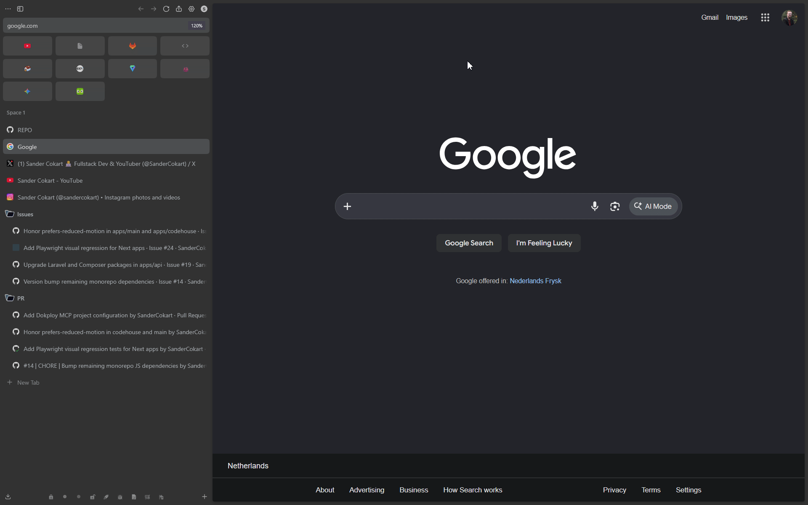
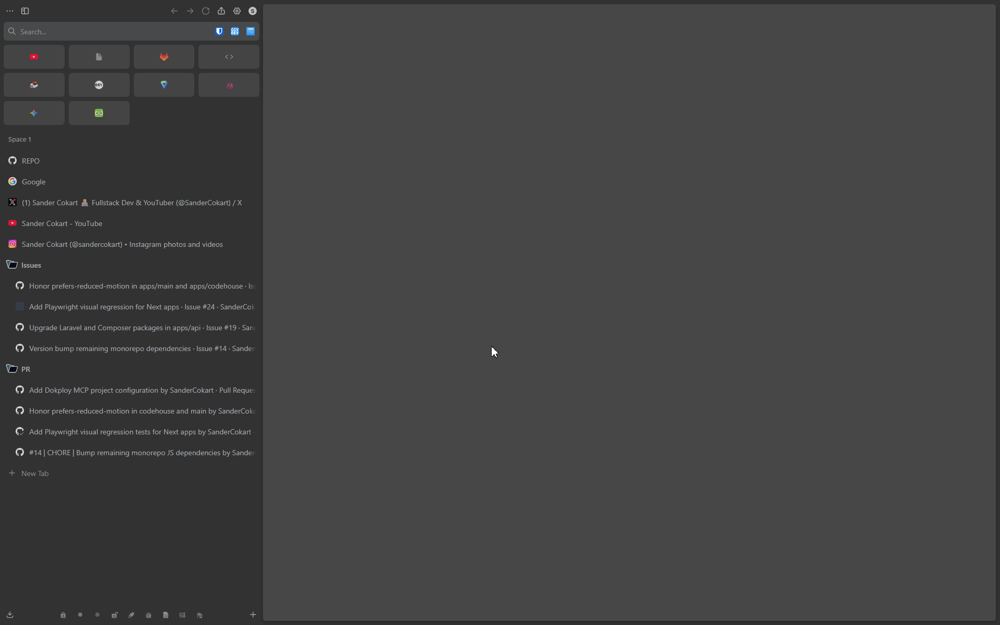
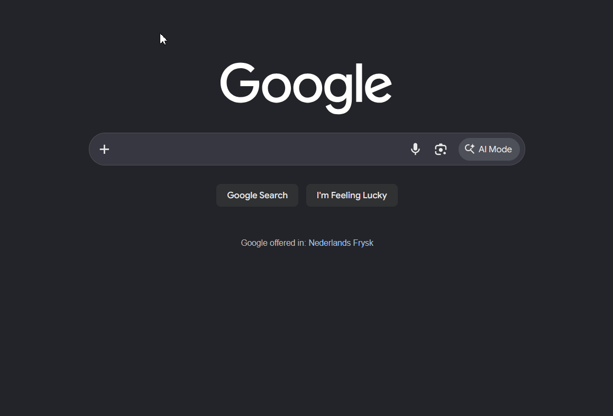
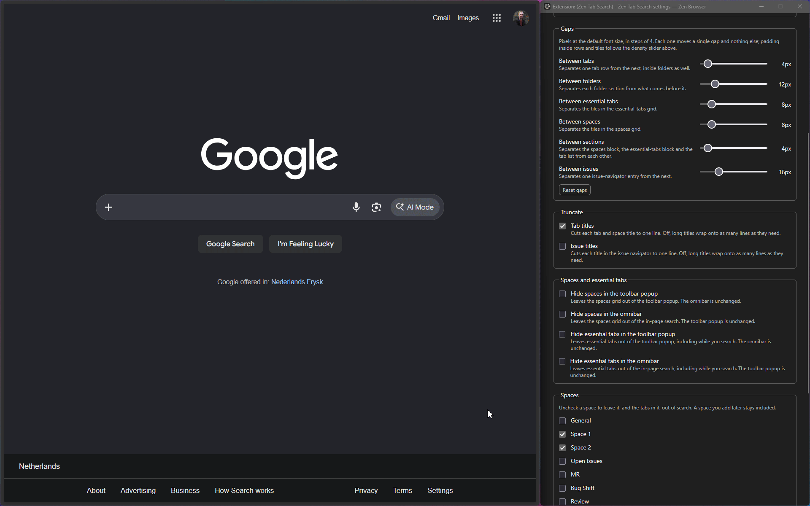
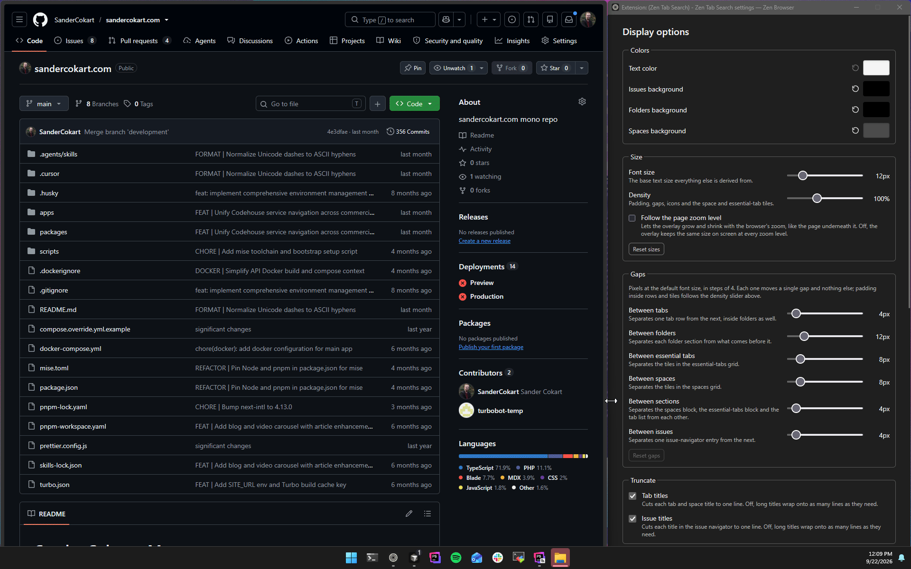
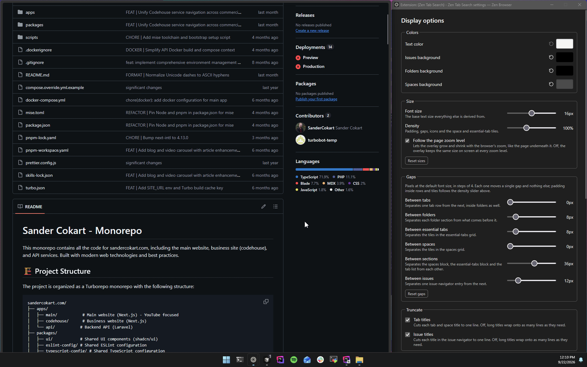
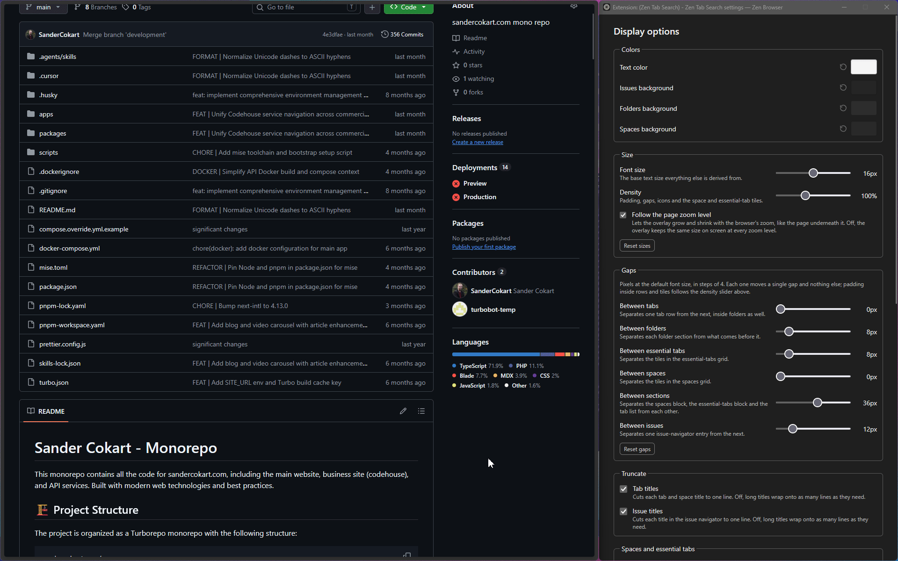
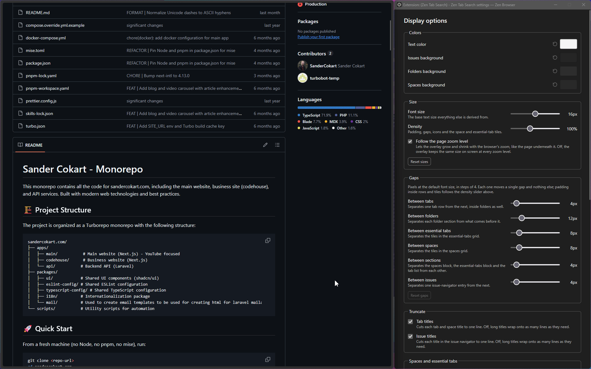
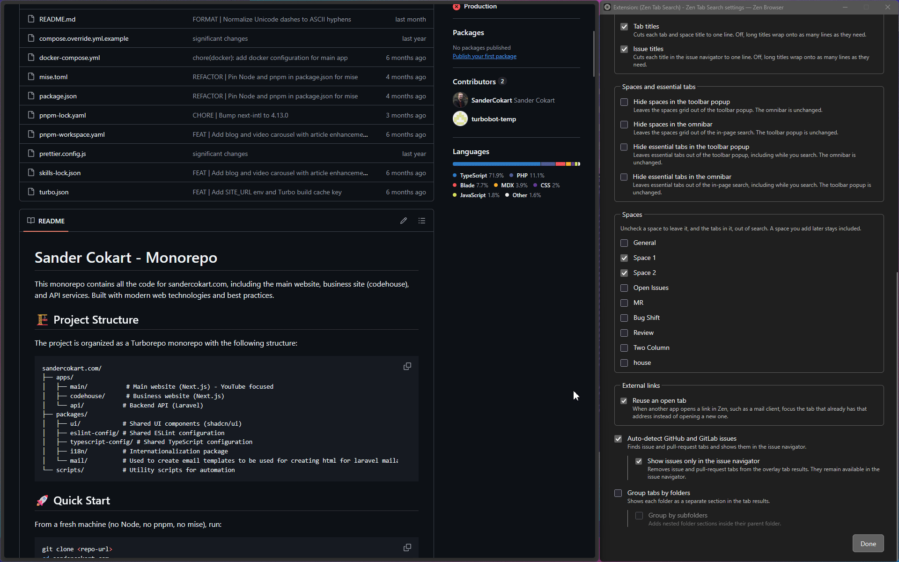

# Zen Tab Search Anytime and Anywhere

Find any tab, switch spaces, add context, and stay focused in Zen Browser.

Zen Tab Search is a fast fuzzy search overlay and popup for tabs, spaces, and custom labels. It is exclusive to [Zen Browser](https://zen-browser.app/).

## Features

Display options open from the gear on either search surface. Change or assign shortcuts in `about:addons` → **Zen Tab Search** → **Manage Extension Shortcuts**. Shortcuts below use `Ctrl` on Windows and Linux, and the Control key on macOS.

### Omnibar search

`Ctrl+Shift+F` opens the in-page search overlay when the active tab is an `http`, `https`, or `file` page the extension can attach to. Search matches tab titles, URLs, and custom labels, including tabs in another Zen space. Spaces and essential tabs sit in their own grids above the tab list. While the search field is focused, `Up` and `Down` move one result, `Left` and `Right` jump several results, `Enter` activates the selected result, and `Escape` closes the overlay.

As you can see here you can search tabs, spaces, and essential tabs from the omnibar.



### Popup search

The toolbar popup is the fallback when the active page has no DOM the overlay can attach to. `Ctrl+Shift+F` opens the popup on browser pages and anywhere the in-page overlay cannot attach. `Ctrl+Alt+F` opens the popup directly, including when no web page is active, and pressing it again closes the popup. The same `Up`, `Down`, `Left`, `Right`, `Enter`, and `Escape` keys work while the search field is focused. Features that exist on both surfaces are shown once below.

As you can see here you can search from the toolbar popup when the omnibar has no page to attach to.



### Auto-detect GitLab and GitHub issues

**Auto-detect GitHub and GitLab issues** finds issue, pull request, and merge request tabs and shows them in the issue navigator beside the tab results, sorted by when you last opened them. The omnibar is a wide panel while detection is on. **Show issues only in the issue navigator** keeps those tabs in the navigator and out of the tab list, and is available while detection is on.

While the omnibar is open and both lists have results, `Tab` moves the keyboard between the tab list and the issue navigator. Typing `#` or `!` at the start of the query moves the keyboard to the issue navigator. `Enter` opens the selected issue.

As you can see here you can keep GitHub and GitLab issues beside your tabs and move between the two lists from the keyboard.



### Hide essentials and spaces

You can leave the spaces grid, the essential-tabs grid, or both out of the omnibar, the popup, or each surface on its own. Hiding a grid on one surface leaves the other surface unchanged, including while you search.

As you can see here you can hide spaces, essential tabs, or both from search.



### Truncate titles

**Tab titles** keeps each tab and space title on one line. **Issue titles** does the same for the issue navigator. Leave either option off and long titles wrap onto as many lines as they need. Section headers stay on one line either way.

As you can see here you can truncate tab titles, issue titles, or both, and let them wrap when you want the full text.


### Spacing, size, and zoom

**Font size** is the base the omnibar is built from. **Density** scales padding, icons, and the space and essential-tab tiles. Six gap sliders, in pixels at the default font size, each move one gap: between sections, tabs, folders, essential tabs, spaces, and issues. Padding inside rows and tiles follows density.

**Follow the page zoom level** lets the omnibar grow and shrink with the page. Leave it off and the omnibar keeps the same size on screen at every zoom level. The toolbar popup stays a compact fixed size; these controls apply to the omnibar.

As you can see here you can set the gaps, font size, and density, and choose whether the omnibar follows the page zoom.



### Theme colors

Set the text color and the background of issues, folders, and spaces. Each color has its own reset. The picker accepts HEX, HSL, and RGB. Text color applies to the omnibar and the toolbar popup. Folder and space backgrounds apply on both surfaces. The issue background applies in the omnibar navigator.

As you can see here you can theme the text and the issue, folder, and space backgrounds.



### Hide spaces from results

Uncheck a space in Display options to leave that space, and the tabs in it, out of search. A space you add later stays included.

As you can see here you can hide specific spaces from the results.



### Reuse an open tab

**Reuse an open tab**, under External links, focuses a tab that already has an address when another app opens that link in Zen, such as a mail client.

As you can see here you can land on the tab that already has the address.


### Folder groups

**Group tabs by folders** turns each Zen folder into its own section. **Group by subfolders** nests those sections inside the parent folder, and is available while folder grouping is on.

As you can see here you can group results by folders and by the subfolders inside them.



### Timers

`Ctrl+Alt+T` opens the timer for the current tab when Zen has a current tab. Right-click a tab and use **Tab timer** to add 30 minutes, 1 hour, 7 hours, 8 hours, or a custom time, or choose **Clear timer**.

From either search surface, the clock on a result opens the same controls, and **Timer** in the result menu does too. The clock beside the search field lists every running timer so you can jump to that tab, clear one, or clear all of them.

As you can see here you can add a timer and clear it from search, from the tab menu, or with the timer shortcut.




## Installation


### From a GitHub release (recommended)

1. Download the latest `.zip` from the [Releases page](https://github.com/SanderCokart/Zen-Tab-Search-Anytime-and-Anywhere/releases).
2. Open `about:config` in Zen Browser.
3. Set these preferences to `true` and restart Zen:
  - `extensions.experiments.enabled`
  - `xpinstall.signatures.required`
4. Open `about:addons`, click the gear icon, and choose **Install Add-on From File…**.
5. Select the downloaded `.zip` (you can also drag it onto the page).


### Build from source

```bash
npm install
npm run zip
```

The zip will be produced by WXT. Install it using the same `about:addons` → gear → **Install Add-on From File…** flow above.

## At a glance

- Omnibar search with `Ctrl+Shift+F`, and a toolbar popup when the page has no DOM
- GitHub and GitLab issues in the issue navigator
- Hide essentials, spaces, or specific spaces from results
- Truncated or wrapping tab and issue titles
- Omnibar font size, density, gaps, and page zoom
- Theme colors for text, issues, folders, and spaces
- Reuse of an already open tab for external links
- Folder and subfolder sections
- Timers you can add and clear from search, the tab menu, or `Ctrl+Alt+T`


## Important notices

- This extension is exclusive to Zen Browser and relies on Zen's internal workspace and tab APIs.
- It uses privileged `experiment_apis`, so it cannot be published on addons.mozilla.org (AMO) and must be installed from a zip file.
- The two `about:config` preferences above are required for Zen's extension APIs to be available.


## Credits and license

This project is based on [https://github.com/AntonDobrovinskiy/Zen-Tab-Search](https://github.com/AntonDobrovinskiy/Zen-Tab-Search), which is released under the MIT license. Anton Dobrovinskiy retains the copyright as per the MIT license.

This repository is a fork of that project with rewritten git history.

See [LICENSE](LICENSE) for the full MIT license text.

## Why this cannot be published on AMO

Mozilla intentionally blocks extensions that declare `experiment_apis` (privileged Experiment APIs) from being submitted to addons.mozilla.org, so this repository does not maintain an AMO signing flow. End users still need the two `about:config` changes for the Zen-specific APIs (`browser.zenTabs`) to be available.

The only supported distribution method for this extension is sideloading a zip (or XPI) as described above.

## Creating a release

Releases are published as GitHub release zips. The release script bumps the package version, commits the version files, tags the commit, builds the extension zip, creates a GitHub release, and attaches the zip.

```bash
npm run release -- patch --message "Maintenance release"
npm run release -- minor --notes-file ./RELEASE.md
npm run release -- patch --generate-notes
npm run release -- major --canary --notes-file ./RELEASE.md
npm run release -- patch --dry-run --generate-notes
```

Use `patch`/`bump`, `minor`, `major`, or an exact `x.y.z` version. Release notes can be supplied with `--message`, loaded with `--notes-file`, or generated from commits since the latest tag with `--generate-notes`. Add `--canary` to publish that tag as a GitHub prerelease, so it is not marked Latest. The script requires a clean working tree and an authenticated GitHub CLI session (`gh auth login`) before it starts.

Release checklist:

1. Start from `main` with `git status` clean.
2. Confirm GitHub CLI auth with `gh auth status`.
3. Preview the release with `npm run release -- patch --dry-run --generate-notes`.
4. Run the release command, for example `npm run release -- patch --generate-notes`.
5. Confirm the GitHub release contains the `zen-tab-search-<version>-firefox.zip` asset.

If a release fails, follow the recovery instructions printed by the script before retrying.

## Development

**Using Cursor?** Run the `[/quick-start](.cursor/commands/quick-start.md)` command.

Otherwise:

```bash
npm install
npm run dev
```

While the dev server is running, WXT rebuilds and reloads the extension on file changes.

Load in Zen Browser:

1. Open `about:debugging`
2. Click **This Firefox**
3. **Load Temporary Add-on…**
4. Select `manifest.json` from `.output/firefox-mv2/`

Run quality checks:

```bash
npm run lint:js
npm run format
npm test
npm run lint:web-ext
```

Pre-commit hooks run through Husky and lint-staged. They format staged JSON, Markdown, and CSS files, run ESLint fixes for staged JavaScript/TypeScript files, and run the `web-ext` lint wrapper when extension files change. The wrapper allows the known privileged `experiment_apis` finding because this project is distributed as a sideload-only Zen Browser zip.

## Project structure

```
entrypoints/          WXT entry points (background, content script, popup, options)
app/                  Background wiring that spans features
features/             search, timers, forge, settings, zen
shared/               Wire protocol, types, logging, styles
public/experiment/    Privileged Experiment API (zenTabs) — required for cross-space Zen support
public/icon/          Extension icons
scripts/              Build and release helpers
docs/gifs/            Feature recordings used above
```


## License

MIT — see [LICENSE](LICENSE). The original author (Anton Dobrovinskiy) retains copyright as per the MIT terms.